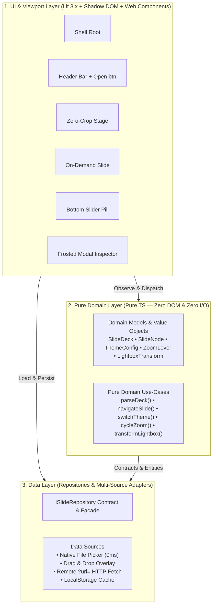

# 📽️ Montre
> **Modern Marp-Superset Presentation Engine & Slide Viewer**  
> *100% Client-Side Pure Web Architecture • Zero-Crop Responsive Stage • Dual Vector Engines (Mermaid + Pure In-Browser PlantUML)*

[](https://github.com/a-chhiong/Montre/actions/workflows/deploy.yml)
[](./LICENSE)

---

## 🌟 What is Montre?

**Montre** (French for *to show / exhibit / watch*) is a modern, high-performance, client-side presentation engine designed to decouple Markdown slide **Authoring (DX)** from **Presentation Runtime (UX)**.

While standard Marp Markdown slides are written in familiar tools (such as VS Code), Montre replaces the rigid SVG runtime with a **Cinema-Grade interactive Web experience**:
* 🚀 **Zero-Crop Responsive Viewport**: Automatically auto-centers dense tables, multi-column cards, and diagrams without truncation.
* 📊 **Dual In-Browser Vector Engines**: On-demand rendering for **Mermaid.js** and **PlantUML** (via `@plantuml/core`, 100% in-browser with zero backend / Java dependencies).
* 🖐️ **Frosted-Glass Vector Lightbox Inspector**: Click any diagram to inspect it with trackpad 1:1 two-finger pan and pinch-to-zoom (`0.4x` to `6.0x`).
* 🔍 **3-Level Projector Scaling (<kbd>Z</kbd> Toggle)**: Instantly cycle scale (`100%` $\rightarrow$ `115%` $\rightarrow$ `130%`) to adapt to meeting rooms, projectors, or 4K auditorium screens.
* 📂 **4-Tier Zero-Friction Ingestion**: Open local files via native file picker (`📂 Open`), drag & drop any `.md` file into the window, pass URL parameters (`?url=...`), or load the bundled default showcase deck.

---

## 🏛️ Frontend 3-Layer Clean Architecture

Montre strictly adheres to **Clean Architecture** principles with inward dependency rules:



---

## ⌨️ Presenter Keyboard & Clicker Shortcuts

| Key / Action | Function | Note |
| :--- | :--- | :--- |
| <kbd>→</kbd> / <kbd>Space</kbd> / <kbd>PageDown</kbd> / <kbd>Enter</kbd> | **Next Slide** | Fully compatible with wireless presenter clickers |
| <kbd>←</kbd> / <kbd>PageUp</kbd> / <kbd>Backspace</kbd> | **Previous Slide** | Reverse slide navigation |
| <kbd>Home</kbd> / <kbd>End</kbd> | **First / Last Slide** | Jump directly to boundaries |
| <kbd>F</kbd> | **Toggle Fullscreen** | Immersive theater presentation mode |
| <kbd>T</kbd> | **Toggle Theme** | ☀️ Radiant Light $\leftrightarrow$ 🌙 Sleek Dark |
| <kbd>Z</kbd> | **Cycle Projector Scale** | 100% $\rightarrow$ 115% $\rightarrow$ 130% |
| <kbd>Esc</kbd> | **Close Lightbox / Exit** | Dismiss vector inspector |

---

## 🛠️ Quick Start & Local Development

### Prerequisites
* Node.js $\ge 18.0.0$
* npm $\ge 9.0.0$

### Setup & Run
```bash
# Navigate to web application directory
cd web

# Install dependencies
npm install

# Run pure TypeScript domain unit tests
npm run test

# Start local development server (with HMR)
npm run dev

# Build production static bundle
npm run build
```

---

## 🚀 Automated CI/CD & Deployment

This repository includes a GitHub Actions workflow (`.github/workflows/deploy.yml`) that automatically:
1. Installs dependencies and runs Vitest unit tests.
2. Compiles TypeScript and builds the optimized production static bundle.
3. Deploys directly to **GitHub Pages** on every push to the `main` branch.

---

## 📄 License

MIT License © 2026 [T.C. Lee (a-chhiong)](https://github.com/a-chhiong)
