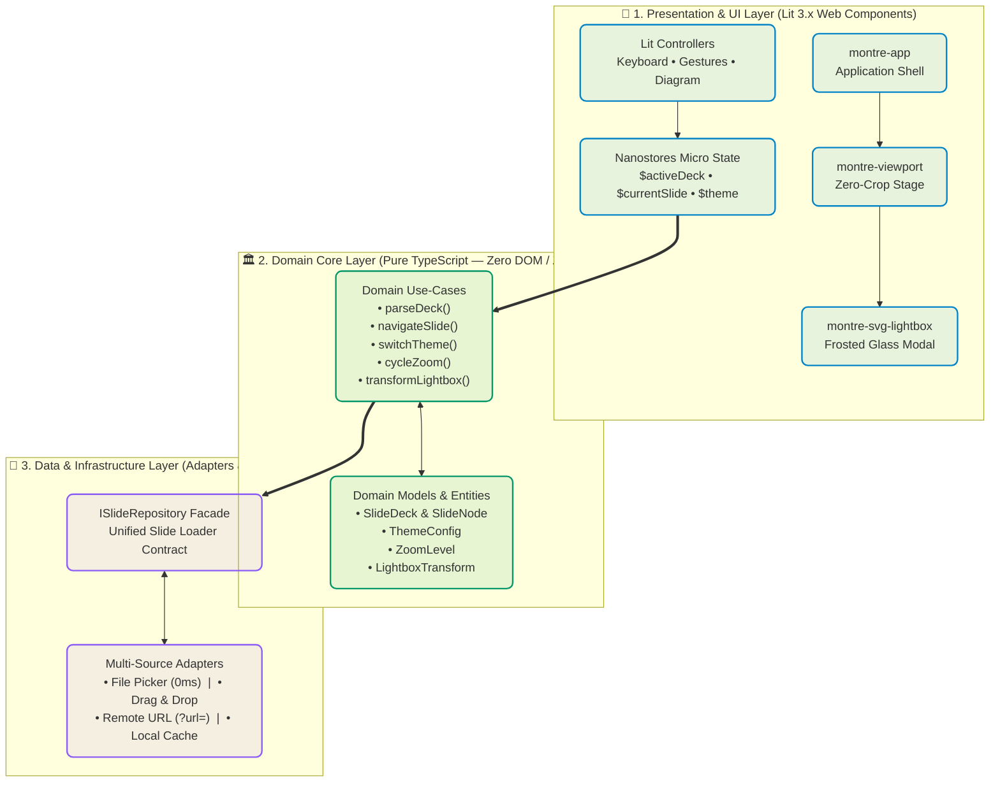
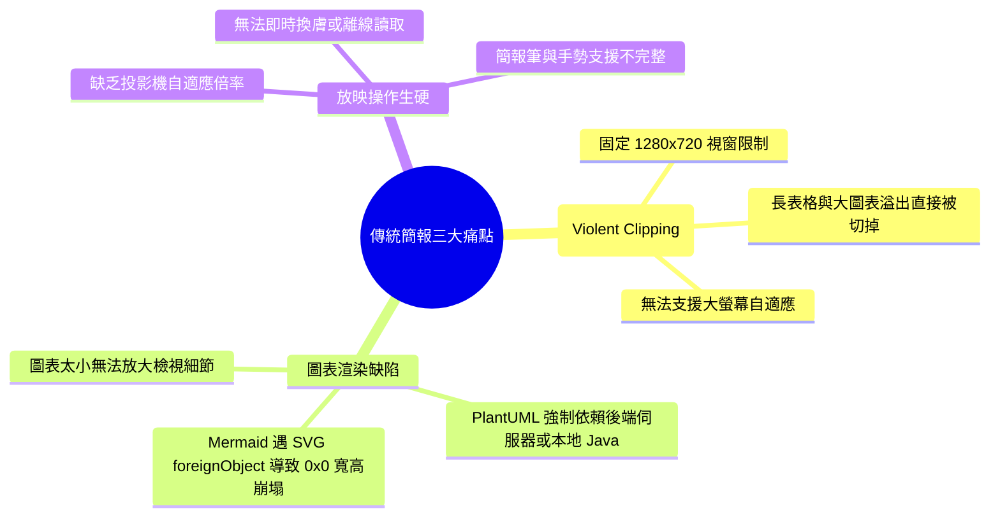
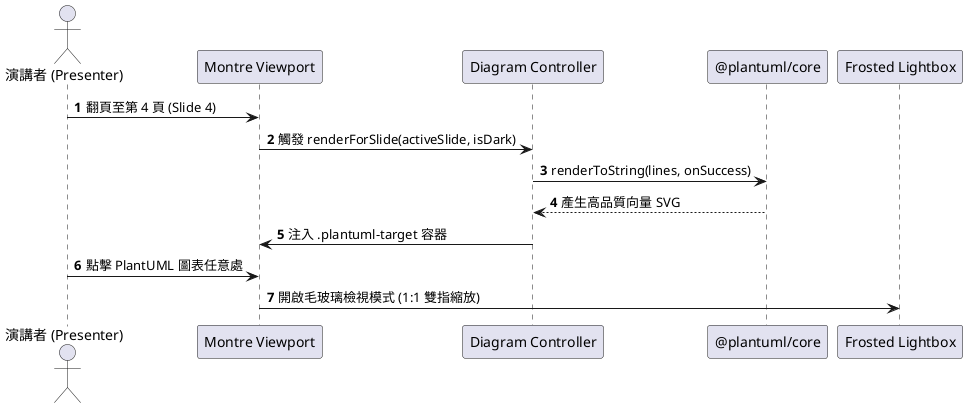
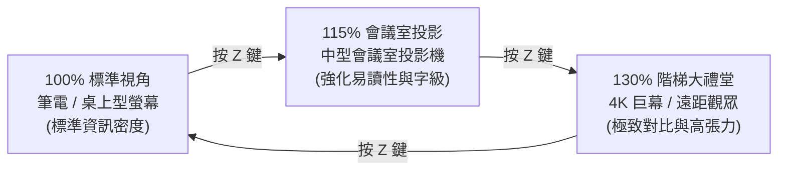
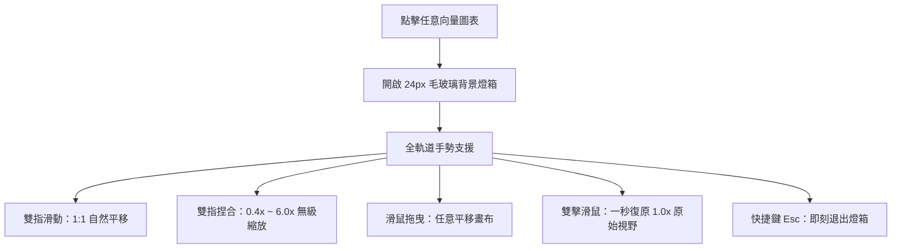

<!-- _class: lead -->
<!-- header: "Montre — Modern Marp-Superset Presentation Engine" -->
<!-- footer: "© 2026 Montre Project • 100% Client-Side Pure Web Architecture" -->

# Montre
### 現代化 Marp 超集投影片播放與演講引擎

`⚡ 60 FPS Zero-Crop Stage` &nbsp;|&nbsp; `🏛️ 3-Layer Clean SoC` &nbsp;|&nbsp; `📊 Mermaid & PlantUML` &nbsp;|&nbsp; `🔍 3-Level Zoom`

> [!NOTE]
> **設計哲學**：將 Markdown 簡報的**撰寫體驗 (DX)** 與**放映體驗 (UX)** 徹底解耦。在保有 Marp 語法標準的同時，提供劇院級流暢度、零裁切視窗與雙指圖表檢視燈箱。

---

## 🏛️ Slide 2 | 前端 3-Layer 乾淨架構拓撲 (Clean Architecture)

Montre 核心嚴格遵循 **關注點分離 (SoC)** 與 **單向依賴規則**，達成領域邏輯 100% 純淨無 I/O 依賴：

> [!TIP]
> **可測試性保證**：`src/domain/` 內無任何瀏覽器 window / DOM API 呼叫，可由 Vitest 進行 100% 毫秒級自動化單元測試。

---

## ⚡ Slide 3 | 現代簡報常見痛點與 Montre 核心突破

傳統 Markdown 簡報工具在面對工程與架構演講時，常遭遇三大痛點：

> [!IMPORTANT]
> **Montre 解決方案**：
> 1. **Zero-Crop 自適應視窗**：內容過長自動置中並提供平滑滾動緩衝區。
> 2. **向量燈箱**：點擊圖表立即進入 24px 毛玻璃雙指縮放檢視。
> 3. **純前端 PlantUML**：透過 `@plantuml/core` 達成 100% 零後端本機秒開。

---

## 🌐 Slide 4 | 純瀏覽器 PlantUML 序列圖原生支援

Montre 內建整合 **`@plantuml/core`**（由 TeaVM 編譯），無須 Java 或後端伺服器即可在瀏覽器端本地產生向量 SVG：

> [!TIP]
> **點擊上方圖表**：即可進入毛玻璃燈箱，享受觸控板 1:1 雙指平移與 Pinch-to-zoom 縮放！

---

## 📊 Slide 5 | 高對比架構評估與規格比較矩陣

Montre 採用語意化排版，針對長表格與複雜對比資料提供自動高對比斑馬紋與標籤樣式：

| 評估維度 | 傳統 Marp CLI | Slidev (Anthony Fu) | Reveal.js | **Montre (本專案)** |
| :--- | :--- | :--- | :--- | :--- |
| **運作機制** | Node.js 本地編譯輸出 | Vite + Vue3 重型建置管線 | 需依賴打包或 HTML 標籤 | 🟢 **100% 純瀏覽器靜態運行** |
| **語法相容** | 原生 Marp 語法 | ❌ 不相容 (Vue SFC) | ❌ 不相容 | 🟢 **100% 原生相容 Marp 語法** |
| **內容裁切** | ❌ **強行剪裁 (Fixed SVG)** | ⚠️ 需手動調整 UnoCSS | ⚠️ CSS Scale 模糊/溢出 | 🟢 **零裁切舞台 (Zero-Crop)** |
| **向量圖表** | ⚠️ Mermaid 易遇 0x0 崩塌 | 依賴 Node 外掛 | 需自掛 JS 外掛 | 🟢 **雙引擎 (Mermaid + PlantUML)** |
| **投影縮放** | ❌ 無法動態縮放 | ❌ 固定比例視窗 | ❌ 需修改全域設定 | 🟢 **Z 鍵秒切 (100%/115%/130%)** |
| **圖表燈箱** | ❌ 無 | ❌ 無 | ❌ 無 | 🟢 **24px 毛玻璃雙指手勢燈箱** |

---

## 🔍 Slide 6 | 3 級投影機自適應縮放引擎 (<kbd>Z</kbd> Toggle)

針對不同演講場地（筆電螢幕、會議室投影、大型 4K 階梯演講廳），Montre 提供全域 CSS 向量級無失真縮放：

### 縮放技術核心亮點
1. **向量級銳利度**：透過 `--zoom-factor` 變數聯動字級與容器最大寬度 (`calc(1200px * var(--zoom-factor))`)。
2. **零重新排版閃爍 (Zero Reflow Jitter)**：圖表與字體同時等比例平滑過渡。
3. **記憶持久化**：選擇的縮放比例自動存入 `LocalStorage`，下次開啟自動套用。

---

## 🖐️ Slide 7 | 毛玻璃向量圖表燈箱與雙指手勢人體工學

點擊投影片上的任何 Mermaid 或 PlantUML 圖表，即可無縫喚醒 **Frosted Glass Lightbox**：

> [!NOTE]
> **極致克制**：燈箱底部僅保留 4 顆微型膠囊按鈕（`➕ 放大`、`➖ 縮小`、`🔄 1.0x`、`✕ 關閉`），最大化視覺畫布。

---

## 📂 Slide 8 | 4 級零摩擦 Markdown 載入機制 (Zero-Friction Ingestion)

Montre 支援 4 種多元載入途徑，適應個人演講、團隊共享與企業 CI/CD：

| 載入管道 | 操作方式 | 適用場景 |
| :--- | :--- | :--- |
| **1. 檔案選擇器 (File Picker)** | 點擊頂部 `📂 Open` 按鈕選取本地 `.md` 檔案 | 0ms 本地即開即講，資料絕不上傳伺服器 |
| **2. 視窗拖放 (Drag & Drop)** | 從 Finder / 檔案總管拖入任何 Markdown | 直覺極速載入，自動浮現毛玻璃 Dropzone |
| **3. 網址參數 (`?url=...`)** | 網址附帶 `?url=https://raw.github.../deck.md` | 團隊跨平台一鍵分享、GitHub Pages 部署 |
| **4. 內嵌示範 (Embedded Default)** | 首次開啟網頁無參數狀態 | 自動載入本導覽簡報，開箱即用不空白 |

> [!TIP]
> **當機保護**：所有本地載入的 Markdown 自動存入本地 Session 快取，網頁重整 (<kbd>F5</kbd> / <kbd>Cmd+R</kbd>) 現場 100% 自動復原！

---

## ⌨️ Slide 9 | 簡報筆與演講者鍵盤快捷鍵一覽

為了讓講者在講台上保持流暢節奏，Montre 支援全套簡報筆肌肉記憶：

| 鍵盤按鍵 / 動作 | 觸發功能 | 備註說明 |
| :--- | :--- | :--- |
| <kbd>→</kbd> / <kbd>Space</kbd> / <kbd>PageDown</kbd> | **下一頁 (Next Slide)** | 完美相容 USB/藍牙無線簡報筆 |
| <kbd>←</kbd> / <kbd>PageUp</kbd> | **上一頁 (Prev Slide)** | 簡報筆往回翻頁 |
| <kbd>Home</kbd> / <kbd>End</kbd> | **跳至第一頁 / 最後一頁** | 快速總結與回顧 |
| <kbd>F</kbd> | **切換全螢幕 (Fullscreen)** | 沉浸式劇院放映模式 |
| <kbd>T</kbd> | **深淺色主題切換 (Theme Toggle)** | ☀️ Radiant Light $\leftrightarrow$ 🌙 Sleek Dark |
| <kbd>Z</kbd> | **循環投影機縮放 (Cycle Zoom)** | 100% $\rightarrow$ 115% $\rightarrow$ 130% |
| <kbd>Esc</kbd> | **關閉圖表燈箱 / 退出全螢幕** | 無痛快速返回簡報 |

---

## 🎯 Slide 10 | 總結與立即開始使用

### 🚀 歡迎體驗現代化 Markdown 簡報新標準！

Montre 結合了 **純前端乾淨架構**、**高對比劇院級視覺** 與 **極致流暢的人體工學互動**。

> [!IMPORTANT]
> **開始打造你的專屬簡報**：
> 1. 直接按頂部 **`📂 Open`** 選取你的 Marp Markdown 檔案。
> 2. 或直接將 `.md` 檔案**拖入本視窗**。
> 3. 按 <kbd>F</kbd> 進入全螢幕，即刻開啟震撼全場的精彩演講！

* 🌐 開源儲存庫：[GitHub - a-chhiong/Montre](https://github.com/a-chhiong/Montre)
* 📖 架構設計白皮書：[ARCHITECTURE_AND_IMPLEMENTATION_PLAN.md](file:///Users/softmobile/Documents/Git/GitHub/a-chhiong/Montre/.agents/ARCHITECTURE_AND_IMPLEMENTATION_PLAN.md)
* 📄 基準驗收檔案：[FRONTEND_SLIDES.md](file:///Users/softmobile/Documents/Git/GitHub/a-chhiong/Montre/.agents/FRONTEND_SLIDES.md)
